# SOFTWARE DEVELOPMENT PLAN
### Written by: Wilson Esmundo

## T1A2. Introduction
---
This Section describes a summary of essential information listed below:
* Statement of Purpose and Scope
* Features
* User Interaction and Experience
* Control Flow Diagram
* Implementation Plan
* Development Log
* Application Implementation
* Test Application Results
* Developers Operation

## T1A2.1 Statement Purpose
---
The purpose of this Terminal Application is to help Bird enthusiast specifically collectors and breeders of Agapornis Roseicollis also known as Rosyfaced or Lovebirds managed, organised and tracked bird in hand.  It also provides access to Genetic Mutation calculator to enable the breeder the possible genetic outcome for any combination of breeding pair. 
 
Identifying birds are easy when there are only three to five pairs to begin with, however, when they start to hatch in which they are between one to seven, it starts to get complicated. Most likely, they will produce birds that are identical and will be hard to distinguish. After about three months, they may have a new batch of hatchlings and when you put them all together in one flight cage, you will no longer be able to keep track of their ages and remember which pair they came from.

This app is developed to help breeders have differentiation of birds in keeping and make this a valuable resource to the user by recording any vital information by using the journal option. Some breeders also look for specific colour so an access to genetic mutation calculator comes in handy. Having a database as such would allow the user to make sure that the bird is mature enough to breed.

## T1A2.2 Features
---
* ### T1A2.2.1 
The Terminal Application functions as a database with specific characteristics to describe individual bird entry for record management. All data entered will be stored in a separate text file for future retrieval of information. Database of birds can be shown in a list sorted by the the moment they were encoded in the application. Each bird database can also be deleted in the application which subsequently updates the said text file. The said function is the first option in the main menu so users can easily add Bird information instantly with typing only the Bird Identification number as the initial input and the rest of it will be shown as menu choices. 
 
* ### T1A2.2.2
Another vital function of the Terminal application is the ability to link the user to the website which is necessary to Bird breeders. New breeders issues were always the colour of the birds they want to produce.  Some will questioned how come the same colours of birds always shows up whenever they breed. Whenever the user chooses the Bird Colour Calculator, it will load a website which has a very simple interface for users to interact. They just need to enter information about the possible birds they want to breed and the website will list all the possible combination of colours and mutation incase they breed that said pair. 
 
* ### T1A2.2.3
Final feature of the Terminal application is the Bird Journal.  All bird breeders encounters problem especially if their stocks were already large and often times overlook things because of the volume of birds they have. Problem such as running out of food, medication or supplements of birds, also situations like negligence because breeders failed to check something on their aviary. With the Bird Journal, they can add as many notes they want by going to the Bird Journal option and choose add Journal. They will also be provided an option to list every journals they've added and like the first feature, all data will be saved in a specific text file for future retrieval. Lastly, they have option to delete specific notes which will be updated in the text file.  
 
* ## T1A2.3 User Interaction and Experience
---
The users of the Terminal Application were able to meet the following criteria: 
* Ease of Menu 
The Terminal application has a Menu choices so users will be able to visualize the functionality of the program by selection options. 
* Ease of Navigation 
Most users of the application were not familiar with the Terminal through their computer but since the app has built in Menu system, users will be able to use just arrow and enter key to navigate through the application which lessen typographical errors. 
* User Friendly 
The application wont complicate things for the users, since it has a clean menu and uses arrow keys for navigation, its simplicity and function will be suitable for non techy users. 
* Less Errors 
With is designed, end user will commit less mistakes thus preventing the application to run its function in addition to its error handling process set in place for those unseen bugs in the program.

* ## T1A2.4 Control Flow Diagram
---
Please find attached pdf file of the Control Flow Diagram. 
 
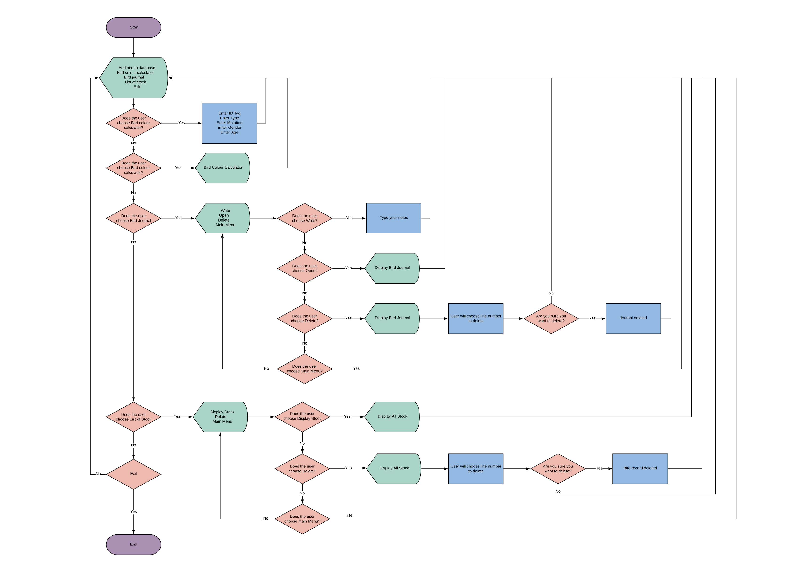 

* ## T1A2.5 Implementation Plan
---
We were given 12 days to finish the Terminal Application thus implementation of plan is essential in providing successful outcome. 
The priority for the project is the partial Documentation and the Bird Database feature and was given 2-3 days to complete. 
 
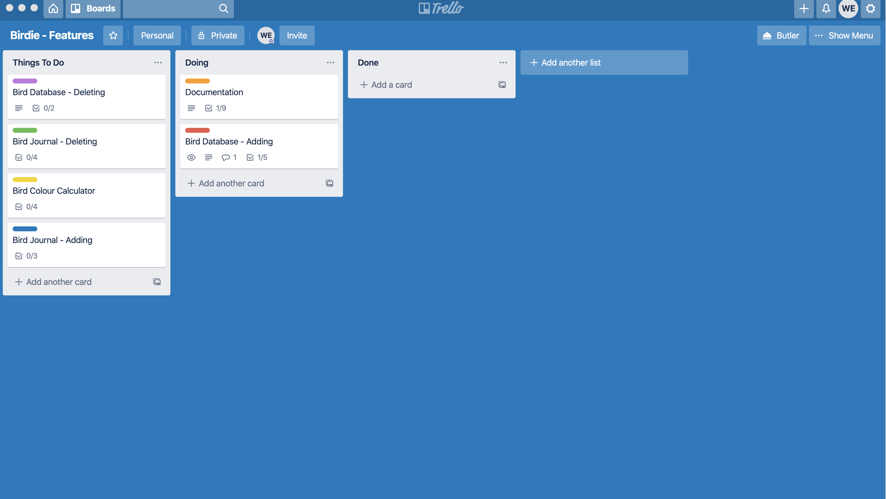 
 
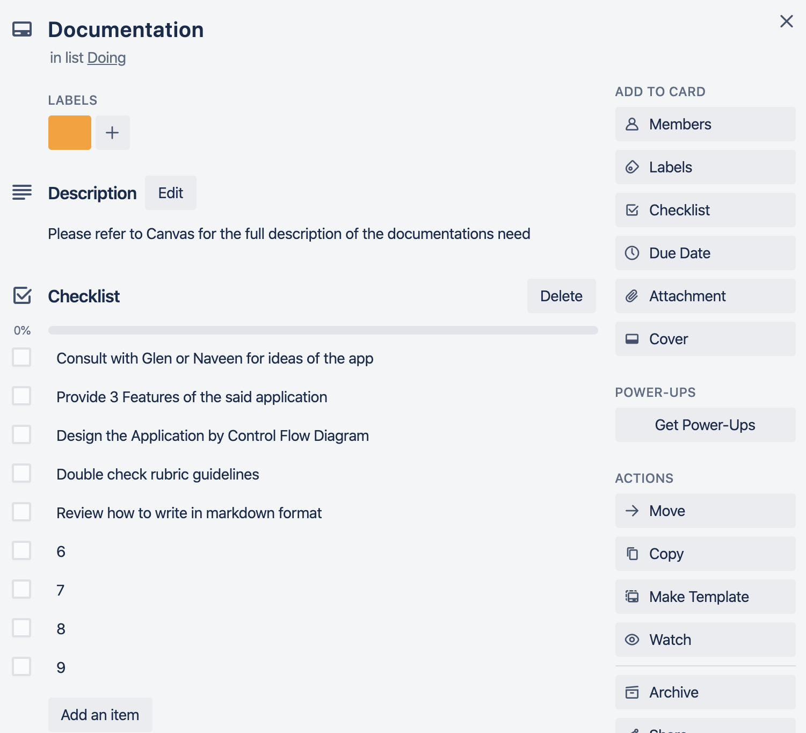 
 
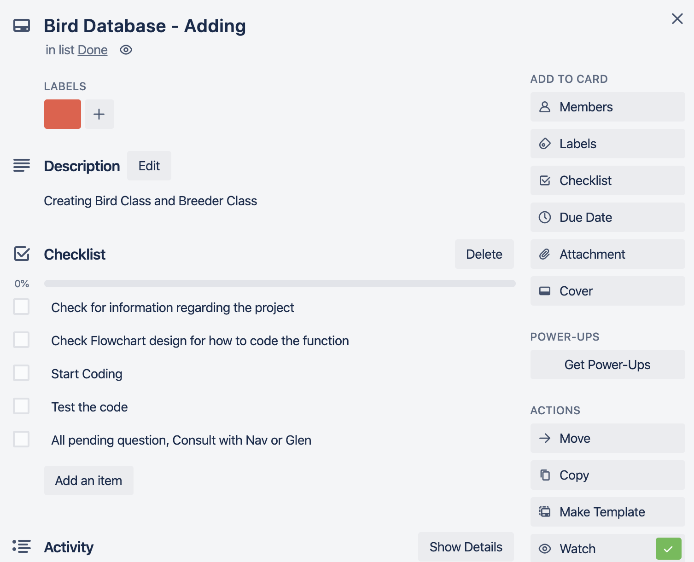 
 
The next task were Adding Journal and still continuing the Documentation and were given 2 days deadline. 
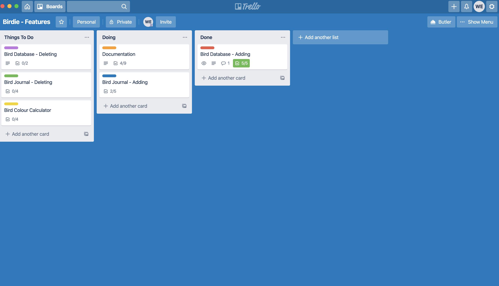 
 
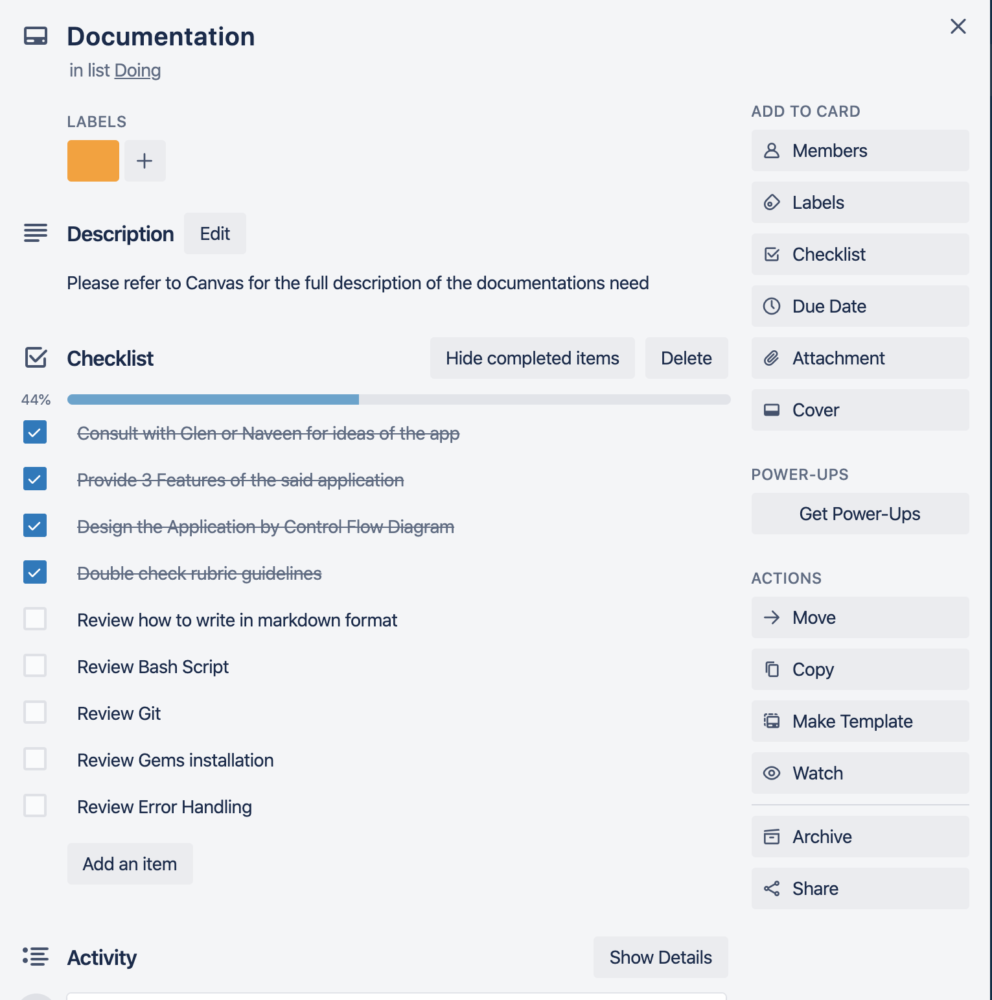 
 
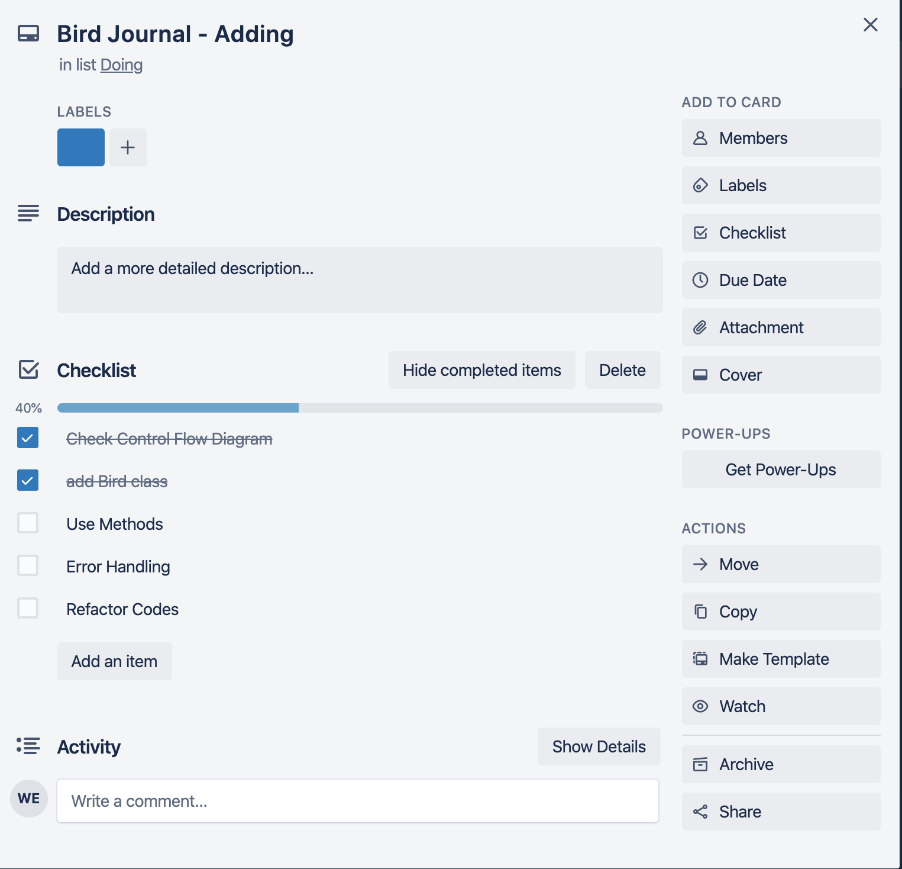 
 
The next task was still Documentation and added Deleting function of Database and Journal and were given 2-3 days to complete. 
 
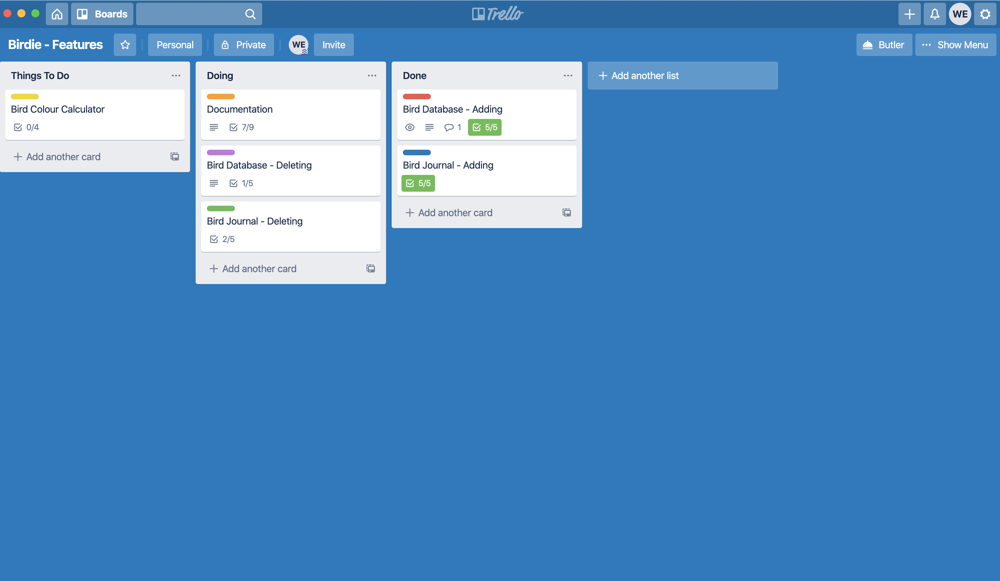 
 
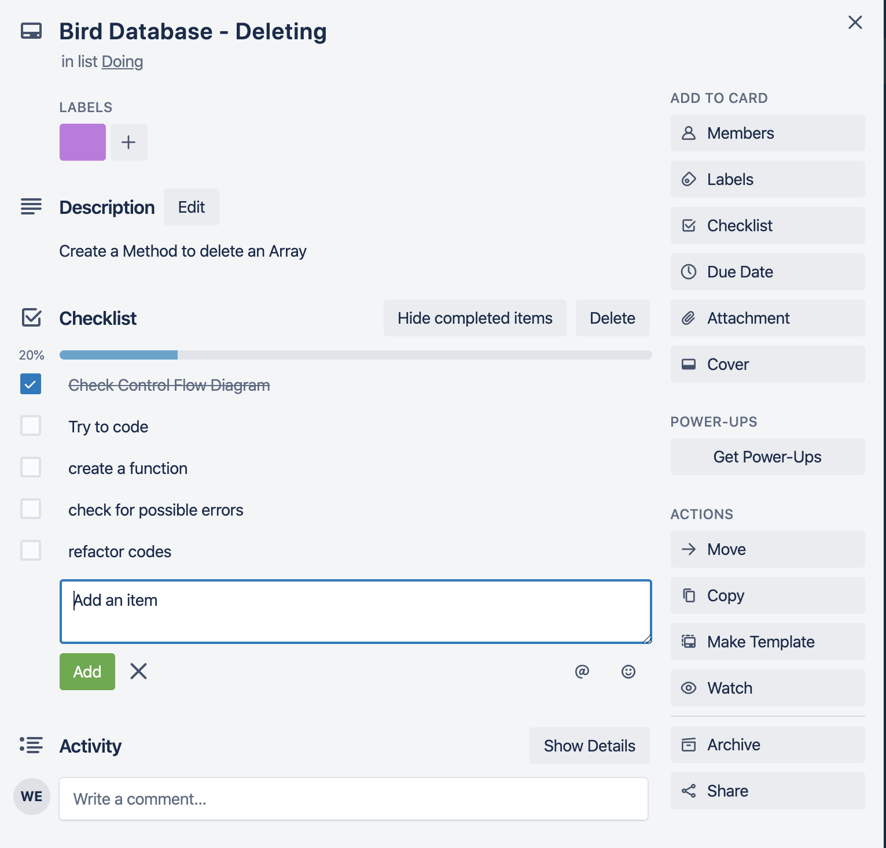 
 
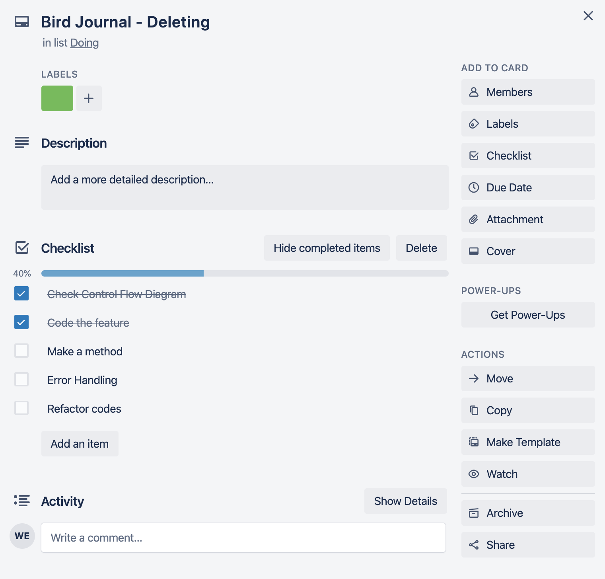 
 
Finally the Bird Colour Calculator and Documentation were finished last. 
 
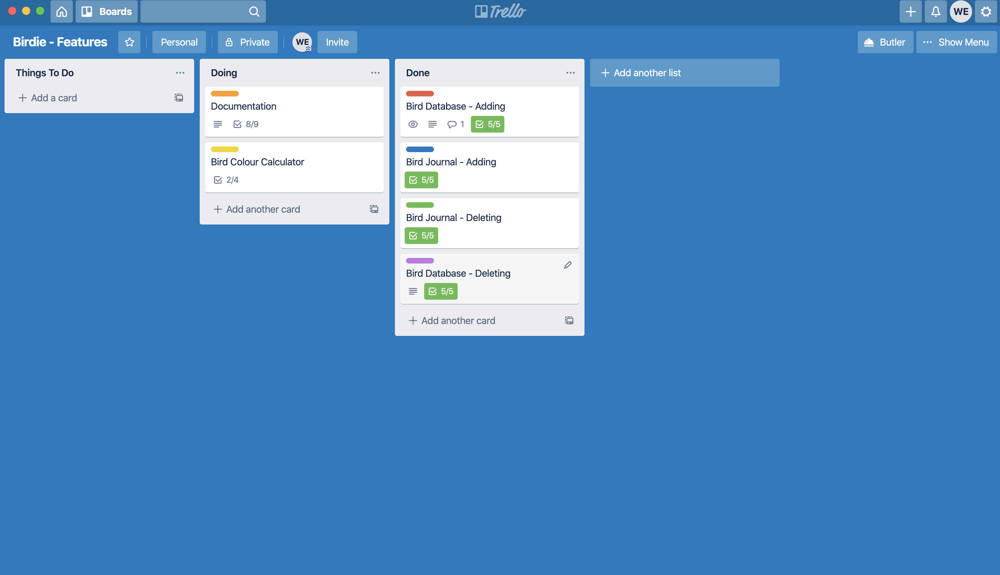 
 
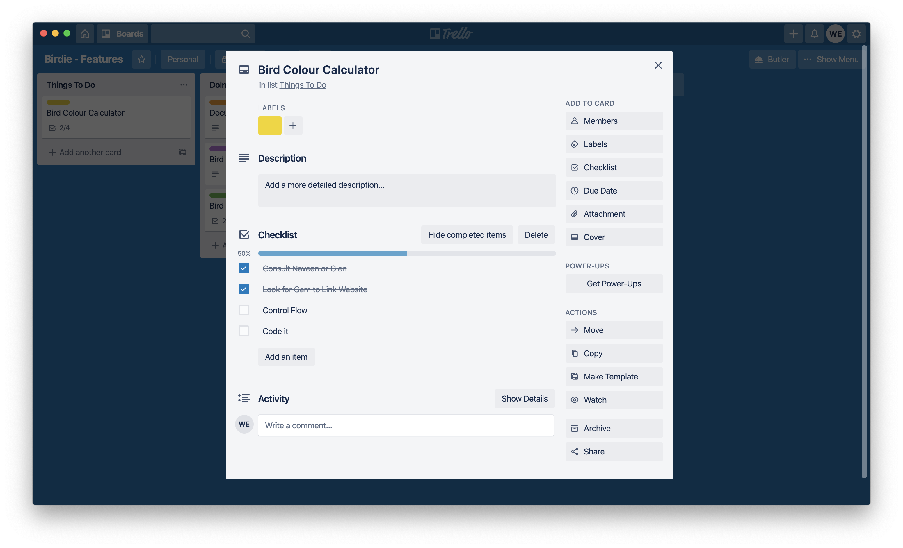 
 
* ## Development Log
---

 ## T1A2.3 User Interaction and Experience
---
How to use the the Application: 
* Copy the Application folder to your computer
* Open the Terminal Application and go to the directory where you save the Application 
* Run birdie.rb file
* To **add Bird in the database**, choose **"Add Bird to Database"** in the Menu.
* Fill in the ID tag number and press enter
* Select the type by using arrow keys and press enter
* Select the colour by using arrow keys and press enter
* Select the sex by using arrow keys and press enter
* Select the age by using the arrow keys and press enter
Press space or enter to continue
* To **Check all the Birds database** 
* Choose **List of Stocks** from the Menu then press enter
* Then choose **Display Stocks** using arrow keys and press enter
* Press space bar or enter to return to main menu
* To **Delete a Bird Entry** 
* Choose **List of Stocks** from the menu using arrow keys then press enter
* Choose **Delete Stocks** from the menu using arrow keys then press enter
* From the list, use **1 2 3 4...** to choose which one you want to delete. The number 1 starting from the top going down.
* When you've chose the number type it and press enter
* If you've accidentally pressed a letter or a special character, it will prompt an error and you'll be return to the Main Menu.
* In case you've type a number thats not in the equivalent list, it will prompt an error and you'll be return to the Main Menu.
* If you've type a correct number equivalent and press enter, you'll be prompted if you want to delete or not.
* If you press **Y** it will display that its deleted successful and if you press **N** it will return you back to the main menu.
* To enter a **Bird Journal** from the main menu using arrow keys choose **Bird Journal** and press enter.
* To Write choose **Write Journal** using arrow keys and press enter and start typing where it says "Please type your notes here"
then press enter once done. Press space bar/enter to continue.
* To **Open Saved Journal** from the main menu select **Bird Journal** using arrow keys and press  enter.
* Select **Open Journal** using arrow keys and press enter and you'll be listed with all the notes just press space bar or enter to go back to main menu.
* To **Delete Journal** using arrow key from the main menu then press enter.
* Choose **Delete Journal** and press enter
* From the list, use **1 2 3 4...** to choose which one you want to delete. The number 1 starting from the top going down.
* When you've chose the number type it and press enter
* If you've accidentally pressed a letter or a special character, it will prompt an error and you'll be return to the Main Menu.
* In case you've type a number thats not in the equivalent list, it will prompt an error and you'll be return to the Main Menu.
* If you've type a correct number equivalent and press enter, you'll be prompted if you want to delete or not.
* If you press **Y** it will display that its deleted successful and if you press **N** it will return you back to the main menu.
* To go to **Bird Colour Calculator** from the Main Menu using arrow keys choose **Bird Colour Calculator** then press Enter.
* It will open a new page in your browser and just fill in information and press **Generate**
* To **Quit** program from the main menu using arrow choose **Exit** and press enter.